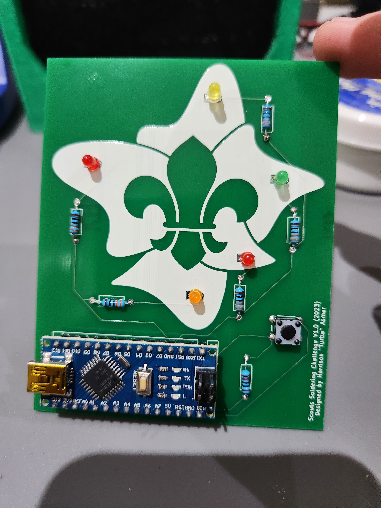

# Scouts-Soldering-Challenge

 
A soldering challenge suitable for Scouts all the way to Rovers.

As a member of the Australian Scouting movement, the logo has been used within this design for the purpose of promoting the movement, and to help the project to the target audience of Scouting members. 

For more information and/or assistance with implementing this challenge in your own Scout group, contact me at harrison@crankshafttech.com 

### For more information on the Australian Scouting Movement, visit https://scouts.com.au

## Components Required
- 1x PCB (see 'pcb' folder)
- 2x Red LED
- 1x Green LED
- 1x Yellow LED
- 1x Orange LED
- 5x 330 ohm resistor
- 1x 10k ohm resistor
- 1x 6x6mm push button
- 1x Arduino Nano

